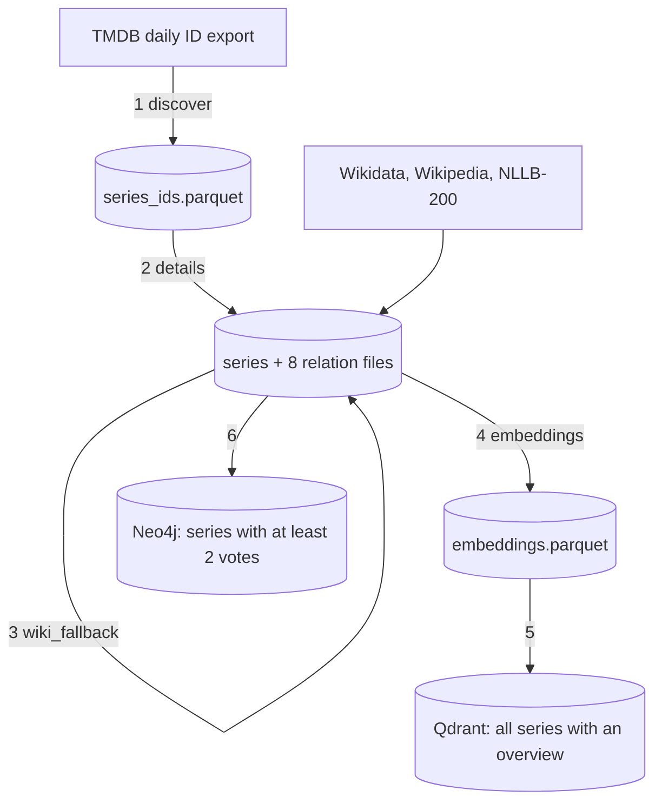
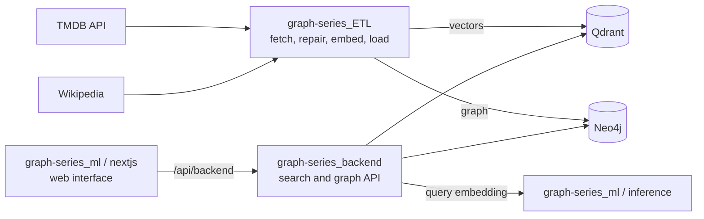

# Graph Series ETL

The data pipeline behind **Graph Series**, a search and exploration system for TV series. It pulls about 230,000 series from the TMDB API, repairs thin descriptions from Wikipedia, computes sentence embeddings, and loads the result into two stores: a vector index (Qdrant) for semantic search and a graph (Neo4j) for navigating cast, creators, genres, keywords, networks and countries.

It also contains an evaluation script that checks how well the loaded embeddings retrieve a series from its own title.


*Title-as-query retrieval over 500 random series on the live index (2026-10-01), drawn from the committed per-query results ([evaluation](docs/evaluation.md)).*

> This product uses the TMDB API but is not endorsed or certified by TMDB.

## What this project demonstrates

- **A six-step, restartable pipeline** from TMDB's daily id export (232,755 ids in the local snapshot of 2026-09-30) to two databases, with idempotent loaders: `MERGE` for the graph and upsert by id for the vectors ([pipeline](docs/pipeline.md)).
- **One request per series.** TMDB's `append_to_response` returns details, external ids, keywords, credits and ratings in a single call, rate-limited to 30 requests per second with a shared token bucket and back-off for 429s.
- **Thin descriptions repaired offline.** For overviews under 200 characters the pipeline finds the Wikipedia article through Wikidata and translates non-English text with NLLB-200 on the local machine, no API key needed.
- **An evaluation that separates artefacts from real misses.** Hit@1 is 0.606 over all 500 queries and 0.642 once 42 queries with a title shared by another series are set aside; 26 % of the remaining queries still miss the top 10 ([evaluation](docs/evaluation.md)).
- **Guards against mistaking a smoke test for the real thing**: `validate.py` fails on small files by design and the evaluation refuses a ground truth under 1,000 series.
- **Honest accounting of what is wrong.** The documentation lists the problems found by reading and running the code, such as `--resume` skipping a partial step and a long fetch being all-or-nothing; most of them have since been fixed, the rest are listed ([known problems](docs/pipeline.md#known-problems)).

## Contents

[Idea](#idea) · [Features](#features) · [How it works](#how-it-works) · [Results and evaluation](#results-and-evaluation) · [Quick start](#quick-start) · [Usage examples](#usage-examples) · [Configuration](#configuration) · [Command reference](#command-reference) · [Repository layout](#repository-layout) · [Tests and quality](#tests-and-quality) · [Deployment](#deployment) · [Limitations](#limitations) · [Related repositories](#related-repositories) · [License and attribution](#license-and-attribution)

## Idea

Search over TV series needs two kinds of data that no single source packages together: **meaning** (descriptions that can be embedded and searched by mood and theme) and **relationships** (who acted in what, which genres and keywords a series has). TMDB has both, per series, behind one API. The pipeline turns that into:

1. a **vector index** of every series that has a description (about 211,000), and
2. a **graph** of series that someone has rated (at least two votes, about 56,000) with their people and facets.

The two stores share one key, the TMDB id, so a search hit is a graph node without a lookup table. The API on top of them is [`graph-series_backend`](https://github.com/GKatzer/graph-series_backend); the web interface is [`graph-series_ml`](https://github.com/GKatzer/graph-series_ml).

## Features

Details of every step, with parameters and failure behaviour: [`docs/pipeline.md`](docs/pipeline.md). File schemas: [`docs/data-model.md`](docs/data-model.md).

| Step | Command | What it does |
|---|---|---|
| 1 discover | `python pipeline.py --steps tmdb_discover` | downloads TMDB's daily id export (tries today and the two previous days), drops adult entries → `data/raw/tmdb_series_ids.parquet` |
| 2 details | `python pipeline.py --steps tmdb_details` | one request per series (10 workers, 30 requests per second, retries, 404 skipped, failures listed for `--retry`) → `tmdb_series.parquet` plus genres, keywords, networks, countries, languages, cast, creators and directors |
| 3 Wikipedia fallback | `python pipeline.py --steps wiki_fallback` | for overviews under 200 characters: Wikidata sitelinks → English article, else the original language, else any of 31 translatable languages → NLLB-200 translation → `overview` and `overview_source` updated |
| 4 embeddings | `python pipeline.py --steps embeddings` | `BAAI/bge-small-en-v1.5`, 384 dimensions, L2-normalised, text `name. overview Keywords: …`, without the query instruction |
| 5 Qdrant | `python pipeline.py --steps qdrant_loader` | upserts points with id = `tmdb_id` and payload, over gRPC |
| 6 Neo4j | `python pipeline.py --steps neo4j_loader` | `MERGE` of series (`vote_count >= 2`), people, facets and eight edge types |
| validate | `python validate.py` | checks every Parquet file: presence, columns, minimum rows, empty values, duplicates |
| evaluate | `python eval_retrieval.py --source qdrant` | Hit@1, Hit@10 and MRR for title queries, with ambiguous titles reported separately |

## How it works



The steps are separate programs that exchange Parquet files in `data/raw/` and `data/processed/`; `pipeline.py` runs any subset in order.

**Key design decisions** (reasons and what was dropped: [`docs/design-decisions.md`](docs/design-decisions.md)):

- **TMDB instead of Wikidata**, with Wikidata kept only as a bridge to Wikipedia.
- **Offline translation** with NLLB-200: no API key and no per-request cost, at the price of a slow step without a GPU.
- **Documents are embedded without the BGE query instruction**; the inference service and the evaluation add it to queries.
- **The index is wider than the graph**, and the backend filters results to series present in the graph.
- **Edges carry no properties**, because the backend reads none; the schema contract lives in the backend repository.
- **Idempotent loaders and visible guards** instead of destructive reloads.

## Results and evaluation

`eval_retrieval.py` takes random series from the live collection, searches with each **title** as the query (with the BGE query instruction, on the same model as production) and checks whether the series itself comes back in the top 10. It is a sanity check of the index and the query encoding, not a measure of recommendation quality.

500 random queries, query = title, live collection, 2026-10-01 (intervals: Wilson 95 % for proportions, bootstrap for MRR):

| Metric | All queries (n = 500) | Excluding ambiguous titles (n = 458) |
|---|---|---|
| Hit@1 | 0.606 (0.563 to 0.648) | **0.642** (0.597 to 0.684) |
| Hit@10 | 0.716 (0.675 to 0.754) | 0.738 (0.696 to 0.776) |
| MRR | 0.648 (0.609 to 0.687) | **0.680** (0.640 to 0.720) |

Part of the "misses" are not retrieval errors. For 42 of the 500 queries (8.4 %) the catalogue contains another series with exactly the same title (game-show formats such as *Match Game* or *Top Gear* are remade under the same name in many countries), so a title alone cannot identify the series. These are flagged from the **full catalogue**, not from the sample; among the 197 queries where the series was not ranked first, 33 were of this kind, and a check based on the top result's title would have caught only 16 of them. The other misses are real: without ambiguous titles 26 % (120 of 458) are not in the top 10, typically short or generic titles whose embedding is closer to another series' text. Method, caveats (a title is a poor stand-in for a real query, exact-string ambiguity, one run) and reproduction: [`docs/evaluation.md`](docs/evaluation.md). The numbers were recomputed from the committed per-query results; the evaluation was not rerun here.

The effect of the graph-based re-ranking on top of this is evaluated in `graph-series_backend` (genre overlap@10 0.764 → 0.774).

## Quick start

Requirements: Python 3.12 (3.10 or newer should work; not checked), a free [TMDB API key](https://www.themoviedb.org/settings/api) for step 2, a GPU for fast embeddings and translation (`--device cpu` works on the standalone scripts), and for the last two steps a Qdrant 1.9 server and a Neo4j 5 database.

```bash
git clone https://github.com/GKatzer/graph-series_ETL.git
cd graph-series_ETL
python -m venv .venv && . .venv/bin/activate
pip install -r requirements.txt          # includes torch via sentence-transformers: a large download
cp .env.example .env                     # TMDB_API_KEY and the database addresses
python pipeline.py --steps tmdb_discover tmdb_details --limit 50      # smoke test: 50 series
```

The full run takes hours (the details step is rate-limited) and was **not run here** (no TMDB key, Qdrant or Neo4j in this environment). What was run, in a clean environment with only the light dependencies (`pandas pyarrow requests aiohttp python-dotenv numpy`), against the 50-series sample that earlier smoke tests left in `data/`:

```bash
$ python docs/examples/parse_demo.py > /dev/null && echo parsed          # synthetic TMDB response → rows
parsed
$ TMDB_API_KEY= python tmdb_fetcher.py --details --limit 5
TMDB_API_KEY не задан — добавь его в .env (ключ получают на https://www.themoviedb.org/settings/api)
$ python validate.py | tail -3
  Итого: 1 OK  |  0 с предупреждениями  |  10 FAIL  |  всего 11      # sample data fails the minimum-row checks on purpose
```

(The messages and logs of the scripts are in Russian.) Note on `--resume`: it now skips only discover; details, the Wikipedia fallback and embeddings continue where they stopped by themselves, so `--resume` just runs them (the old behaviour, a 0.0 s skip of the whole details step, was checked before the change; the new one by reading `_is_done`).

## Usage examples

```bash
python pipeline.py --steps tmdb_details wiki_fallback --limit 100       # smoke test of the middle steps
python tmdb_fetcher.py --details --retry                                # repeat only the ids that failed
python wiki_fallback.py --min-chars 300 --device cpu                    # a different threshold, no GPU
python embeddings.py --batch-size 256 --device cpu                      # smaller batches, no GPU
python qdrant_loader.py                                                 # upsert; add --recreate to rebuild the collection
python neo4j_loader.py --min-votes 5                                    # a smaller graph
python validate.py --files cast genres --verbose
python eval_retrieval.py --source qdrant --verbose --csv report.csv
```

What one TMDB response becomes (a **synthetic** response, no network): [`docs/examples/parse_demo.py`](docs/examples/parse_demo.py) and its output [`parse_demo.out`](docs/examples/parse_demo.out). For example, an actor with roles of 10 and 6 episodes becomes one cast row with `episode_count` 16, and only crew jobs named `Director` become director rows.

## Configuration

Read from `.env` (copy `.env.example`); checked against the code with `grep`.

| Variable | Used by | Meaning | Default | Required |
|---|---|---|---|---|
| `TMDB_API_KEY` | `tmdb_fetcher.py` | TMDB v3 key | none | for step 2 |
| `NEO4J_URI` | `neo4j_loader.py` | Bolt address | `bolt://localhost:7687` | for step 6 |
| `NEO4J_USER` | `neo4j_loader.py` | user | `neo4j` | no |
| `NEO4J_PASSWORD` | `neo4j_loader.py` | password | empty | for step 6 |
| `QDRANT_HOST` | `qdrant_loader.py`, `eval_retrieval.py` | Qdrant host | `localhost` | for step 5 |
| `QDRANT_PORT` | same | REST port; the loader uses gRPC on this port + 1 | `6333` | no |
| `QDRANT_COLLECTION` | same | collection name | `graph-series` | no |

## Command reference

| Script | Options |
|---|---|
| `pipeline.py` | `--steps` (any of `tmdb_discover tmdb_details wiki_fallback embeddings qdrant_loader neo4j_loader`; default all), `--resume`, `--limit N` (details and Wikipedia fallback only), `--device {auto,cuda,cpu}` (auto) |
| `tmdb_fetcher.py` | `--discover`, `--details`, `--retry`, `--limit`, `--workers` (10), `--rps` (30), `--no-resume` |
| `wiki_fallback.py` | `--limit`, `--min-chars` (200), `--workers` (8), `--rps` (10), `--device {cuda,cpu}` (cuda) |
| `embeddings.py` | `--batch-size` (512), `--device {cuda,cpu}` (cuda) |
| `qdrant_loader.py` | `--recreate` (drop and recreate the collection) |
| `neo4j_loader.py` | `--only {nodes,edges}`, `--min-votes` (2), `--max-cast` (20), `--max-directors` (10) |
| `validate.py` | `--verbose` (alias `--fix`), `--files <stems…>`; exits 1 on any failure |
| `eval_retrieval.py` | `--n` (500), `--seed` (42), `--k` (10), `--query-field {title,summary}`, `--device {cpu,cuda}` (cpu), `--source {auto,parquet,qdrant}`, `--verbose`, `--csv PATH`, `--allow-small` |

## Repository layout

```
graph-series_ETL/
├── pipeline.py          step runner (subset, resume, smoke-test limit)
├── tmdb_fetcher.py      ID export and per-series details; parse_series / parse_relations
├── wiki_fallback.py     Wikidata → Wikipedia summary → NLLB-200 translation
├── embeddings.py        bge-small-en-v1.5 vectors
├── qdrant_loader.py     vector index loader (gRPC, upsert by tmdb_id)
├── neo4j_loader.py      graph loader (batched MERGE)
├── validate.py          Parquet file checks
├── eval_retrieval.py    retrieval evaluation
├── requirements.txt, .env.example, LICENSE
├── docs/
│   ├── pipeline.md          every step, parameters, idempotence, known problems
│   ├── data-model.md        file schemas and where each file ends up
│   ├── design-decisions.md  decisions, reasons, dropped ideas
│   ├── evaluation.md        method, results, caveats, reproduction
│   ├── examples/            parse_demo.py (+ output), the 2026-10-01 per-query results
│   ├── figures/make_figures.py
│   └── media/retrieval-eval.png
└── data/                    git-ignored: raw/ and processed/ Parquet files
```

## Tests and quality

There are no automated tests. Correctness is checked by `validate.py` (file-level checks, minimum sizes), by the retrieval evaluation, and by the guards described above. What was run for this documentation: the parsing functions on a synthetic response (output matches the documented rules), `validate.py` and the `--resume` logic on the local sample, and the recomputation of every evaluation number and interval from the saved results. Not covered by any check: the network steps (TMDB, Wikipedia, translation), the loaders, consistency between files (for example series without embeddings) and the vector dimension.

## Deployment

The pipeline is a batch job, not a service: it runs on a workstation with a GPU on the same private network as the databases, and loads Qdrant and Neo4j over that network (ports published only on private addresses; see the deployment notes in [`graph-series_backend`](https://github.com/GKatzer/graph-series_backend/blob/master/docs/deployment.md)). The Qdrant collection can be created by this repository's loader (`--recreate`) or by `scripts/init_qdrant.py` in `graph-series_ml`, which also creates payload indexes; the Neo4j schema (constraints and the full-text indexes that search depends on) comes from `scripts/schema_init.cypher` in the backend and **must be applied again after every full reload of the graph**. For local development a Qdrant instance can be started with `docker run -p 6333:6333 -p 6334:6334 -v $(pwd)/qdrant_data:/qdrant/storage qdrant/qdrant` (not run here).

## Limitations

- **The vector index covers series with a non-empty overview**; the documentation elsewhere says "an overview or keywords".
- **Retrieval is imperfect even for unambiguous titles** (Hit@1 0.642; 26 % outside the top 10), and the check uses titles, not real queries. Ambiguity is detected by exact string equality.
- **Data coverage is TMDB's**: uneven (about half the series have a cast list, fewer have keywords), so the graph is richer for well-known series.
- **The embedding model is English-only**, while some descriptions come from other languages (translated, with some loss, and the replaced TMDB text is not kept).
- **No incremental update**: the snapshot is refreshed by re-running the pipeline.
- **Pinned versions are partial**: `requirements.txt` pins pandas, pyarrow, requests and `qdrant-client` (1.9.2, as on the server and in the backend); the rest is unpinned.
- **Interruption safety is new and checked only with a mocked fetch**: the details, Wikipedia and embeddings steps write after every chunk; the real network runs were not repeated after the change.
- **Not verified in this environment**: the network steps, the loaders and the evaluation itself (no TMDB key, Qdrant or Neo4j here).

## Related repositories

**Graph Series** is a search and exploration system for about 56,000 TV series. It is built from three repositories that form one pipeline: a data pipeline fills a vector index and a graph database, an API combines the two stores, and a web interface (with the query-embedding service) sits on top.



| Repository | Role |
|---|---|
| `graph-series_ETL` (this) | data pipeline: TMDB fetching, Wikipedia fallback for thin descriptions, embeddings, loading of Qdrant and Neo4j, retrieval evaluation |
| [`graph-series_backend`](https://github.com/GKatzer/graph-series_backend) | API over both stores: `semantic`, `structural`, `hybrid` and person search, similar series, graph endpoints, evaluation of the graph re-ranking |
| [`graph-series_ml`](https://github.com/GKatzer/graph-series_ml) | web interface (Next.js), query-embedding service, Qdrant deployment |

Shared terms: **semantic** search ranks by cosine similarity of embeddings; **structural** search is a full-text match on titles in Neo4j; **hybrid** adds graph bonuses (shared cast, shared country) to the semantic score; **Hit@k** is the share of queries whose target series is among the top k results and **MRR** is the mean of 1/rank of the target. The key of a series is its TMDB id (`tmdb_id`) in every store.

Shared numbers (identical in the READMEs of all three repositories; the retrieval figures come from `graph-series_ETL`, the re-ranking figures are recomputed from the committed CSV in `graph-series_backend`): about 230,000 series fetched, about 211,000 in the vector index, about 56,000 in the graph (at least two votes). Title-as-query retrieval over 500 random series on 2026-10-01: Hit@1 0.606 (0.642 excluding titles shared with another series), Hit@10 0.716, MRR 0.648 (0.680). Graph re-ranking in hybrid mode: genre overlap@10 0.764 to 0.774, a paired difference of +0.0095 (95 % bootstrap interval +0.001 to +0.019).

## License and attribution

License: MIT, see LICENSE.
Author: George Denisov · [GitHub](https://github.com/GKatzer) · [Telegram](https://t.me/denisov_george)

This product uses the TMDB API but is not endorsed or certified by TMDB. Series data comes from [TMDB](https://www.themoviedb.org); descriptions repaired from [Wikipedia](https://www.wikipedia.org) (text under CC BY-SA, summaries fetched through its REST API) and Wikidata; the embedding model is [`BAAI/bge-small-en-v1.5`](https://huggingface.co/BAAI/bge-small-en-v1.5) and the translation model [`facebook/nllb-200-distilled-600M`](https://huggingface.co/facebook/nllb-200-distilled-600M).
