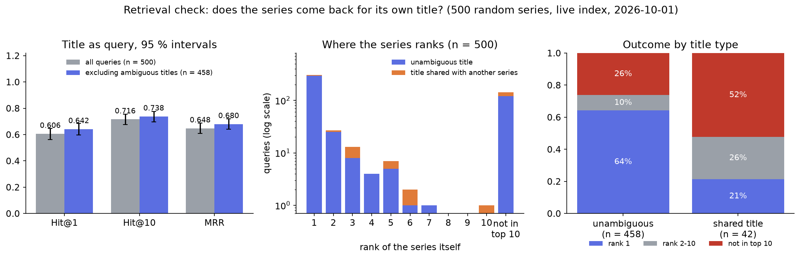

# Evaluation: does the series come back for its own title?

`eval_retrieval.py` checks the embeddings and the vector index end to end: it takes random series from the live Qdrant collection, searches with each series' **title** as the query, and records whether (and where) the series itself comes back. It is a sanity check of the index, **not** a measure of how good "similar series" recommendations are: the query is a title, and the target is the series that has that title. The effect of the graph re-ranking on top of this is evaluated in [`graph-series_backend`](https://github.com/GKatzer/graph-series_backend/blob/master/docs/evaluation.md).



*500 random series, query = title, live collection, run on 2026-10-01. Left: the three metrics for all queries and without ambiguous titles, with 95 % intervals (Wilson for the proportions, percentile bootstrap for MRR). Middle: rank at which the series itself came back (log scale; 142 queries did not find it in the top 10). Right: outcome by title type. Drawn by `docs/figures/make_figures.py` from the committed per-query results.*

## Method

- **Ground truth.** The payload of the live collection (`--source qdrant`: `tmdb_id`, `name`, `overview` of every point, read with `scroll`), so the check does not depend on local files. `--source parquet` reads `data/raw/tmdb_series.parquet` instead.
- **Sample.** 500 random series (`--n`), `random_state=42` (`--seed`).
- **Query.** The title (`--query-field title`, default); `summary` uses the first sentence of the overview. The query gets the BGE retrieval instruction `Represent this sentence for searching relevant passages: `, the same one the inference service of [`graph-series_ml`](https://github.com/GKatzer/graph-series_ml) adds in production, and is encoded with the same model and normalisation.
- **Search.** Top 10 (`--k`) by cosine similarity with `search_batch`, 100 queries per batch, over HTTP on port 6333.
- **Metrics.** Hit@1: the series is ranked first. Hit@10: it is among the top 10. MRR: the mean of 1 / rank (0 when not found).
- **Ambiguous titles.** Some titles belong to several series (game-show formats such as *Match Game* or *Top Gear* are remade under the same English name in many countries), so a title alone cannot identify one of them. A query is flagged **ambiguous** when its title occurs more than once in the **whole catalogue** (all points of the collection, not only the sample, because the namesake is almost never among the 500 sampled rows; it sits in the index as a competing candidate). The report gives every metric both ways.
- **Safeguard.** The script refuses to run when the ground truth has fewer than 1,000 series (`--allow-small` overrides it), so that a leftover smoke-test file cannot silently produce a report.

## Results

| Metric | All queries (n = 500) | Excluding ambiguous titles (n = 458) |
|---|---|---|
| Hit@1 | 0.606 (95 % interval 0.563 to 0.648) | **0.642** (0.597 to 0.684) |
| Hit@10 | 0.716 (0.675 to 0.754) | 0.738 (0.696 to 0.776) |
| MRR | 0.648 (0.609 to 0.687) | **0.680** (0.640 to 0.720) |

The numbers are those printed by `eval_retrieval.py` on 2026-10-01 and were recomputed from the saved per-query results; the intervals are new.

Reading the table and the figure:

- **Ambiguity explains part of the misses.** 42 of the 500 queries (8.4 %) have a title shared with another series. Among them only 9 (21 %) are ranked first, and 22 (52 %) are not in the top 10. Of the 197 queries where the series was not ranked first, 33 are of this kind. A cheaper check ("the top result has the same title as the query") would have identified only 16 of those 33, because the namesake is often not the top result.
- **Most of the remaining misses are real.** Without ambiguous titles, 64 % are ranked first, 10 % at ranks 2 to 10 and **26 % (120 of 458) are not in the top 10**. Typical misses are short or generic titles whose embedding is closer to another series' text: *Frontier of Love* returned *Love of Thousand Years*, *A Different Sky* returned *Another Sky*, *Lotsa Luck* returned *My Precious Bad Luck*, and a short English title returned a series with a non-Latin title.
- **Hit@1 is far below 1 even for unambiguous titles**, so the index is not a title lookup. That is expected: the vectors encode the overview and keywords together with the title, which is what semantic search needs; exact titles are served by the full-text index in the backend.

## Not covered and caveats

- **A title is a poor stand-in for a real query.** Users describe moods and plots; the check only shows that the index and the query encoding work together. It says nothing about the quality of recommendations.
- **One run, one sample** of 500 series on one date over a live collection that changes; the intervals reflect sampling of the 500 queries only.
- **Ambiguity is detected by exact string equality**, so titles that differ only in case or punctuation are treated as unambiguous (one case in the sample: *Echoes of the Past* against *Echoes of The Past*, counted as a real miss).
- **Only the top 10 is examined**, so a series ranked 11th counts as not found.
- **The first-sentence mode** (`--query-field summary`) was not run for this report.
- **Not rerun in this environment**: the script needs the live Qdrant collection and the embedding model; everything above is read from the saved results.

## Reproduce

Needs a Qdrant collection `graph-series` and network access to the model weights; `QDRANT_HOST`, `QDRANT_PORT` and `QDRANT_COLLECTION` come from `.env`:

```bash
python eval_retrieval.py --source qdrant --verbose --csv report.csv     # report*.csv is git-ignored
```

The figure and the intervals can be recomputed without any database from the committed copy of the 2026-10-01 results:

```bash
pip install pandas matplotlib
python docs/figures/make_figures.py
# all queries {'Hit@1': (0.606, 0.563, 0.648), 'Hit@10': (0.716, 0.675, 0.754), 'MRR': (0.648, 0.609, 0.687)} n = 500
# excluding ambiguous titles {'Hit@1': (0.642, 0.597, 0.684), 'Hit@10': (0.738, 0.696, 0.776), 'MRR': (0.68, 0.64, 0.72)} n = 458
```
