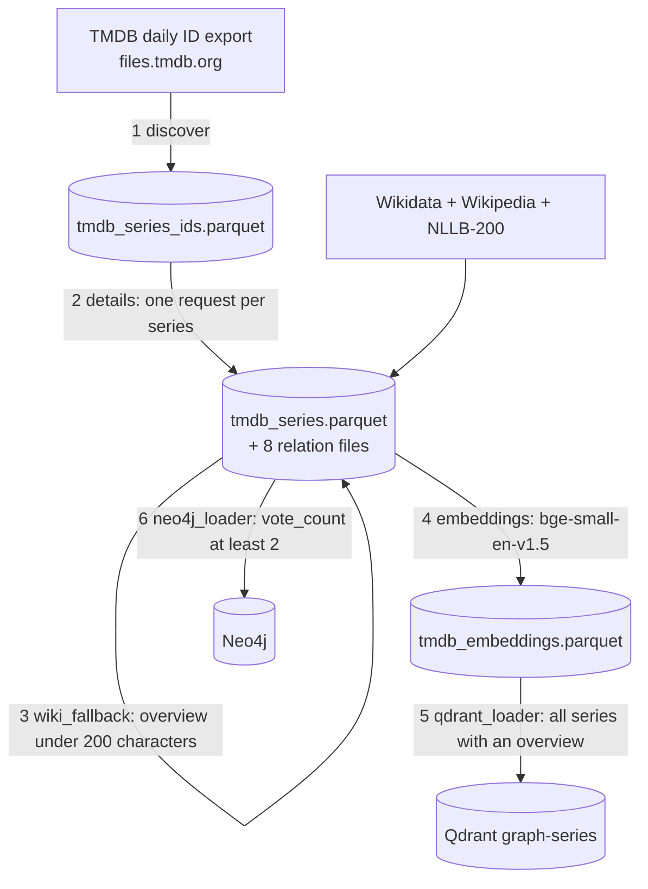

# Pipeline

Every step of the ETL, what it reads and writes, its parameters and its failure behaviour, as implemented in the code. Checked by reading the code, by running the offline parts (`validate.py`, the `--resume` logic of `pipeline.py`, the parsing functions on a synthetic response) and against the small local data sample (50 series) that the smoke tests left in `data/` (git-ignored). The steps that call external services (TMDB, Wikipedia, Qdrant, Neo4j) were **not run** in this environment: there is no TMDB key, Neo4j or Qdrant here.

**Contents:** [Overview](#overview) · [Running it](#running-it) · [1 discover](#1-discover) · [2 details](#2-details) · [3 Wikipedia fallback](#3-wikipedia-fallback) · [4 embeddings](#4-embeddings) · [5 Qdrant](#5-qdrant-loader) · [6 Neo4j](#6-neo4j-loader) · [Validation](#validation) · [Idempotence and restarts](#idempotence-and-restarts) · [Known problems](#known-problems)

## Overview



| # | Step (`pipeline.py --steps …`) | Reads | Writes | Skipped by `--resume` when |
|---|---|---|---|---|
| 1 | `tmdb_discover` | TMDB daily export | `data/raw/tmdb_series_ids.parquet` | the file exists and is not empty |
| 2 | `tmdb_details` | the id file, TMDB API | `tmdb_series.parquet` and 8 relation files in `data/raw/`, `tmdb_failed.parquet` for failures | never: the step resumes by id on its own |
| 3 | `wiki_fallback` | `tmdb_series.parquet`, Wikidata, Wikipedia | updates `overview` and `overview_source` in place | never (no output file to test) |
| 4 | `embeddings` | `tmdb_series.parquet`, `tmdb_keywords.parquet` | `data/processed/tmdb_embeddings.parquet` | never: the step skips series already embedded |
| 5 | `qdrant_loader` | embeddings and series texts | collection `graph-series` | never |
| 6 | `neo4j_loader` | all raw files | the graph | never |

## Running it

```bash
pip install -r requirements.txt
cp .env.example .env                 # TMDB_API_KEY, Neo4j and Qdrant connection details
python pipeline.py                   # all six steps
python pipeline.py --steps tmdb_discover tmdb_details
python pipeline.py --limit 50        # smoke test: only the first 50 ids in details and wiki_fallback
```

`pipeline.py` runs the chosen steps in order, logs each, keeps going after a failed step and exits with status 1 if any failed. Each step can also be run on its own (`tmdb_fetcher.py`, `wiki_fallback.py`, `embeddings.py`, `qdrant_loader.py`, `neo4j_loader.py`), which exposes more options than the runner.

## 1. discover

Downloads TMDB's daily export `tv_series_ids_<MM_DD_YYYY>.json.gz` from `files.tmdb.org`, trying today, yesterday and the day before (the file is published around 08:00 UTC). Adult entries are dropped, duplicates removed. Output columns: `tmdb_id`, `name` (the original name, or the name if that is empty), `popularity`. The local snapshot from 2026-09-30 has **232,755 ids** (5.4 MB). No API key is needed.

## 2. details

One request per series: `GET /tv/{id}?language=en-US&append_to_response=external_ids,keywords,aggregate_credits,content_ratings`, so a single call returns the details, external ids, keywords, aggregate credits and content ratings. Everything is requested in English because TMDB's coverage is best there.

| Setting | Value |
|---|---|
| rate limit | 30 requests per second, shared by all workers (TMDB's unofficial ceiling is about 40) |
| workers | 10 (`--workers`), rate `--rps` |
| timeout / retries | 30 s per request, 5 attempts |
| HTTP 404 | the series was deleted since the export: counted as `not_found`, skipped |
| HTTP 429 | waits 10, 30, 60, 120 s |
| HTTP 5xx, timeouts, client errors | waits 5 s or 3 s and retries |
| out of retries | counted as `error`; the id goes to `data/raw/tmdb_failed.parquet` (`--retry` repeats just those) |

Progress is logged every 30 s with throughput, ETA and the ok / not_found / error counters. Ids are fetched and saved in **chunks of 10,000** (`CHECKPOINT_EVERY`): after each chunk the relation files and then the series file are merged with the existing files and de-duplicated on their keys (`tmdb_id` for series; `series_id` plus the facet id for relations). An interrupted run loses at most one chunk, and since a series counts as loaded once it is in the series file, a rerun fetches the rest; `tmdb_failed.parquet` is removed when a run has no failures. `--limit N` fetches only the first N remaining ids. A missing `TMDB_API_KEY` stops the step immediately (checked here: `TMDB_API_KEY не задан — добавь его в .env …`).

What is parsed from one response is shown on a synthetic example: [`examples/parse_demo.py`](examples/parse_demo.py) with its output [`parse_demo.out`](examples/parse_demo.out). Rules worth knowing:

- **Cast**: every entry of `aggregate_credits.cast` becomes a row; `episode_count` is the sum over its roles (or `total_episode_count` when that sum is zero); `order` is TMDB's billing order. In the demo, roles of 10 and 6 episodes give 16.
- **Directors**: only crew jobs named exactly `Director`, with that job's episode count. Other crew jobs (writers, producers) are ignored.
- **Creators**: `created_by`.
- **US rating**: the `content_ratings` entry for `US`, empty when absent.
- **Missing values**: empty strings for text, `0` for counts, `False` for `in_production`; years are the first four characters of the air dates.

## 3. Wikipedia fallback

Many lesser-known series have a one-line TMDB overview, which makes a poor embedding. For series whose overview is shorter than **200 characters** (`--min-chars`), has not already been replaced, and has a `wikidata_id`:

1. `wbgetentities` on Wikidata in batches of 50 returns the sitelinks of each entity (language Wikipedias only; Commons, Wikispecies and other projects are skipped).
2. A source article is picked: the English Wikipedia if it exists; otherwise the article in the series' `original_language`; otherwise the first article in any of the 31 languages that NLLB-200 can translate (`NLLB_LANG`).
3. The article's summary is fetched from the Wikipedia REST API (`/page/summary/<title>`, 8 workers, 10 requests per second, 3 attempts, the `extract` field).
4. Non-English summaries are translated to English by `facebook/nllb-200-distilled-600M`, loaded once, run per source language in batches of 16, input truncated to 512 tokens and output up to 1,024; it needs no API key and caches the weights after the first download. The default device is `cuda` (`--device cpu` for no GPU).
5. The rows are updated in place: `overview` is replaced and `overview_source` becomes `wikipedia` (it is `tmdb` otherwise). The whole series file is rewritten **once at the end**.

On the local 50-series sample: 42 rows have `overview_source = tmdb` and 8 have `wikipedia` (all 8 from the English Wikipedia, lengths 205 to 621 characters); 3 of the 50 overviews are still under 200 characters (nothing was found for them or they have no Wikidata id). The sample contains no translated row, so the translation path has not been exercised on local data; the TMDB text that was replaced is not kept, so a before and after pair cannot be shown from the files.

## 4. Embeddings

Model `BAAI/bge-small-en-v1.5`, 384 dimensions, L2-normalised (`normalize_embeddings=True`, so cosine similarity equals the dot product). The text of a series is

```
{name}. {overview} Keywords: {keyword_1}, {keyword_2}, …
```

(`Keywords:` and the list only when the series has keywords). It is encoded **without** the BGE query instruction; the instruction is added to queries only by the inference service in [`graph-series_ml`](https://github.com/GKatzer/graph-series_ml). Series with an empty overview are not embedded, so keywords alone are not enough. Batch size 512 (tuned for an 8 GB GPU, `--batch-size`), device `cuda` by default (`--device cpu`). Series that already have an embedding in the output file are skipped, and new vectors are appended; the file is written once at the end (zstd-compressed Parquet with a 384-float `embedding` list per `tmdb_id`). On the 50-series sample the file holds 50 vectors of 384 floats.

## 5. Qdrant loader

Upserts one point per embedded series: **point id = `tmdb_id`** (the backend retrieves a series' vector by that id), vector of 384 floats, payload `{tmdb_id, name, overview, overview_source, imdb_id, start_year}`. Points go in batches of 256 over **gRPC on `QDRANT_PORT + 1`** (6334 by default) with a 60 s timeout. If the collection does not exist, or with `--recreate` (drops it first), the loader creates it: cosine distance, HNSW `m=16`, `ef_construct=100`, scalar INT8 quantisation (quantile 0.99, always in RAM), indexing threshold 20,000. It is not a clean replacement for `graph-series_ml/scripts/init_qdrant.py`, which also creates payload indexes on `tmdb_id` and `name` and sets `full_scan_threshold`; use that script when those matter. Existing points are overwritten by id, so a rerun is safe.

## 6. Neo4j loader

Loads the graph with batched `UNWIND … MERGE` statements, 1,000 rows per transaction. Only series with `vote_count >= 2` enter the graph (`--min-votes N` changes the threshold; about 56,000 of about 211,000 according to the repository's documentation and comments; 45 of the 50 sample series pass). Nodes first, then edges, edges only between series in the graph:

| Step | Label / edge | Key | Properties set |
|---|---|---|---|
| nodes | `Series` | `tmdb_id` | name, original_name, imdb_id, wikidata_id, tvdb_id, start_year, end_year, status, type, in_production, original_language, season_count, episode_count, episode_runtime, popularity, vote_average, vote_count, us_content_rating, overview, tagline, homepage, poster_path |
| | `Person` | `person_id` | name (union of cast, creators and directors) |
| | `Genre`, `Keyword`, `Network` | `genre_id`, `keyword_id`, `network_id` | name; network also `country` |
| | `Country`, `Language` | `code` | none |
| edges | `ACTED_IN`, `CREATED`, `DIRECTED` | person → series | none |
| | `HAS_GENRE`, `HAS_KEYWORD`, `PRODUCED_IN`, `HAS_LANGUAGE`, `AIRED_ON` | series → facet | none |

Per series at most **20 cast members** (by TMDB billing order) and **10 directors** (by episode count) are loaded, for nodes and edges alike (`--max-cast`, `--max-directors`, 0 means no cap); the Parquet files keep everything. This matches the web app's Methodology page and the deployed graph (20 `ACTED_IN`, 10 `DIRECTED` for Breaking Bad). Checked on the sample: the series with 1,037 cast rows gets 20. Edges carry no properties: the backend does not read any, so `order` and `episode_count` from the cast and director files are not loaded. Empty values are stored as empty strings (the backend turns them into `null`). **The loader does not create constraints or indexes and never deletes anything** (there is no wipe option). The schema, including the two full-text indexes that search depends on, comes from `scripts/schema_init.cypher` in [`graph-series_backend`](https://github.com/GKatzer/graph-series_backend) and has to be applied again after any full reload; the loader prints a reminder when it finishes. `MERGE` makes reruns safe: nodes are updated, edges are not duplicated.

## Validation

`python validate.py` checks each Parquet file: it exists and is not empty, it can be read, the required columns are present, the row count is at least a per-file minimum (150,000 for the series, id and embedding files; 100,000 for genres, keywords and cast; 50,000 for networks, countries and languages; 10,000 for creators and directors), the share of empty values in each required column (warning above 20 %), and fully duplicated rows (warning above 5 %). `--verbose` adds examples, `--files cast genres` limits the check. It exits with status 1 on any failure.

Run on the local 50-series sample (checked 2026-10-04) it **fails by design**: the id file passes (232,755 rows, 232,755 unique ids, 0 % empty), every other file fails the minimum row count (for example `tmdb_series.parquet`: `строк 50 — меньше ожидаемого минимума 150,000`). That is the intended guard against mistaking a smoke-test dataset for a full run. It does not compare files with each other (for example, series without embeddings) and does not check the vector dimension.

## Idempotence and restarts

| Step | Re-running it | If it is interrupted |
|---|---|---|
| discover | overwrites the id file | nothing is written until the end |
| details | skips ids already in `tmdb_series.parquet` (resume is the default of `run_details`; `--no-resume` disables it) | at most the current chunk of 10,000 ids is lost |
| wiki_fallback | skips rows already marked `wikipedia`; rows still short are retried | at most the current chunk of 2,000 candidates is lost (the file is written after each chunk) |
| embeddings | skips series already embedded | at most the current chunk of 20,000 texts is lost (written after each chunk) |
| qdrant_loader | upserts by id | points already sent stay |
| neo4j_loader | `MERGE` | batches already committed stay |

## Known problems

Found by reading the code and by running the offline parts. Items 1–5 and the docstring and pin in item 6 were fixed afterwards; what remains is listed last. The fixes were checked offline only (a mocked fetch with an interruption in the middle, the cap on the sample, the `pipeline.py` resume logic); the network steps were still not run.

**Fixed**

1. **`--resume` skipped a whole step when its output file existed**, even a partial one (`python pipeline.py --steps tmdb_details --resume` finished in 0.0 s). Now only discover is skipped; details, wiki fallback and embeddings resume by themselves (by id, by `overview_source`, by `tmdb_id`), so `--resume` just runs them.
2. **A long run was all-or-nothing.** Details, the Wikipedia fallback and embeddings now write after every chunk (10,000 ids, 2,000 candidates, 20,000 texts). Checked: with an interruption after 20 of 25 ids, 20 were on disk and the rerun fetched the remaining 5.
3. **`pipeline.py` could not select a device.** Added `--device {auto,cuda,cpu}` (default `auto`: cuda if torch sees one, otherwise cpu), passed to the translation and embeddings steps.
4. **No cap on cast or directors.** The Neo4j loader now keeps 20 and 10 per series (see step 6), as the Methodology page says. The earlier note that the deployed graph was built by a different loader is no longer needed for the explanation, but it was not verified against the deployed database.
5. **`qdrant-client` was pinned to 1.9.1** while the server and the backend use 1.9.2; now 1.9.2. The docstring mention of a non-existent `--wipe` was removed.

**Remaining**

- **Search coverage differs from some of the other documentation.** The vector index covers series with a non-empty overview (the code); other documents say "an overview or keywords". The code was left as is because the evaluation was run on this index; the other documents need correcting.
- **Two ways to create the Qdrant collection** with different settings (this loader's `--recreate` and `scripts/init_qdrant.py` in `graph-series_ml`, which also creates the payload indexes). Use the `graph-series_ml` script for the first creation.
- **The TMDB v3 key is sent as the `api_key` query parameter** (the v3 scheme has no header option), so it can appear in URLs in logs or proxies.
- **Most other packages are unpinned.**
- The Wikipedia client's `User-Agent` header names an organisation in the `contact` field; `.claude/settings.local.json` is tracked.
